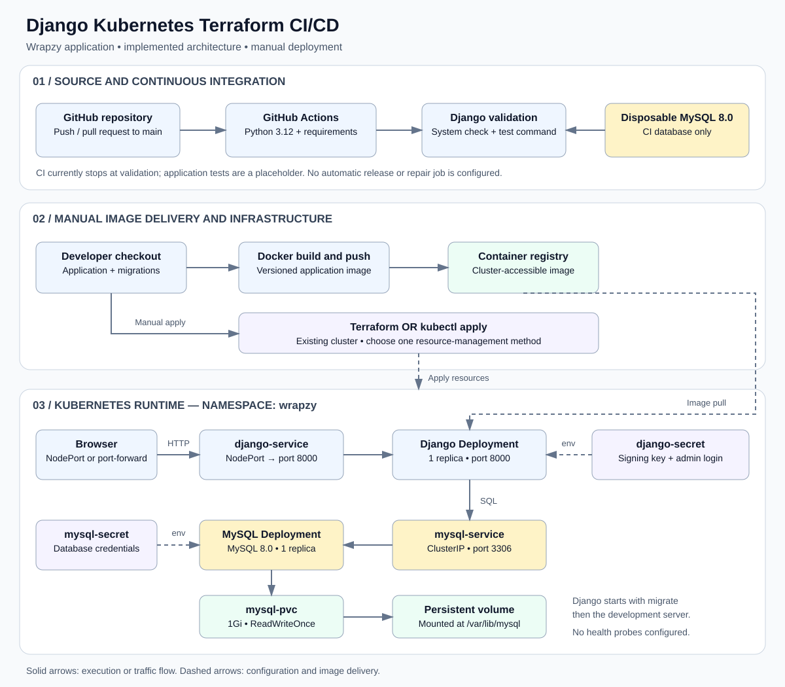
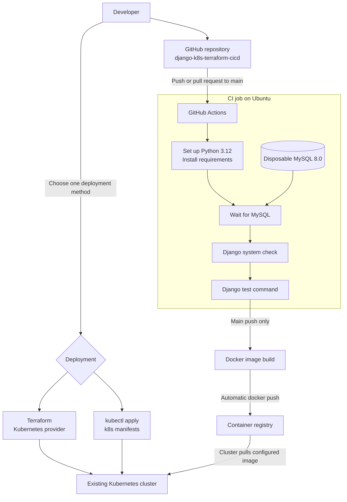
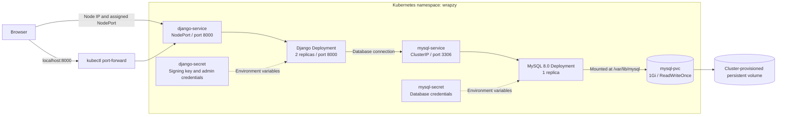
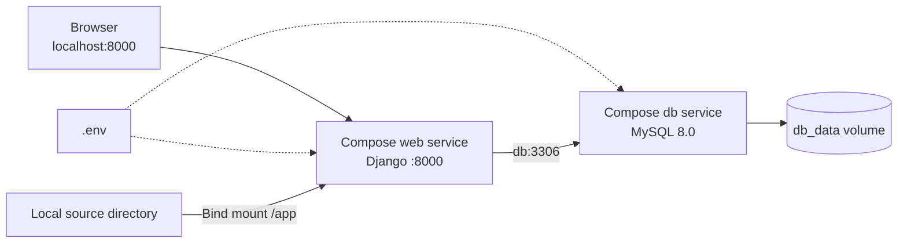

# Django Kubernetes Terraform CI/CD

[](https://github.com/prapanjanprabhu/django-k8s-terraform-cicd/actions/workflows/ci.yml)

**django-k8s-terraform-cicd** demonstrates running a Django application with MySQL, packaging it with Docker, deploying it to Kubernetes, managing infrastructure with Terraform, and validating changes through GitHub Actions.

The included application is **Wrapzy**, a gift-shopping website. Its container images and Kubernetes namespace use the name `wrapzy`.

## Contents

- [Current capabilities](#current-capabilities)
- [Architecture](#architecture)
- [Technology stack](#technology-stack)
- [Project structure](#project-structure)
- [Get the source](#get-the-source)
- [Local setup with Docker Compose](#local-setup-with-docker-compose)
- [Checks and tests](#checks-and-tests)
- [Kubernetes deployment](#kubernetes-deployment)
- [Terraform deployment alternative](#terraform-deployment-alternative)
- [Troubleshooting](#troubleshooting)
- [Deployment limitations](#deployment-limitations)

## Current capabilities

- Customer registration and login, product browsing, carts, and gift orders.
- Custom administration pages for products, storefront content, and order status.
- Docker Compose for local Django and MySQL services.
- Kubernetes Deployments, Services, Secrets, and persistent MySQL storage.
- Terraform configuration for Kubernetes resources.
- GitHub Actions checks and tests on pushes and pull requests to `main`.

The workflow tests pushes and pull requests. Successful pushes to `main` also publish a Docker Hub image tagged with the commit SHA and deploy to Minikube. Failed application rollouts restore the previous Deployment revision when one exists. Startup, liveness, and database-aware readiness probes protect rolling updates; this does not automatically repair source code.

## Architecture

### Complete system overview



[Open the full-size architecture diagram](docs/architecture.svg). The diagram is stored in the repository as an SVG, so it displays directly in the README without requiring Mermaid support.

**How the system works:**

1. A push or pull request to `main` starts GitHub Actions with Python and a disposable MySQL database.
2. CI waits for its database, runs Django's system check, and invokes the test command.
3. After tests pass on a push to main, Actions builds and publishes the image to Docker Hub.
4. A self-hosted runner applies Kubernetes resources, runs a migration Job, and verifies the application rollout.
5. Browser requests reach `django-service`, which routes traffic to the Django pod on port `8000`.
6. Django connects through `mysql-service:3306`; MySQL stores data on the volume requested by `mysql-pvc`.

| Boundary | Responsibility |
| --- | --- |
| GitHub Actions | Test changes, publish images, and deploy successful main-branch pushes |
| Container registry | Store the application image pulled by Kubernetes |
| Terraform / Kubernetes manifests | Define and manage deployment resources |
| Django application | Handle storefront, authentication, carts, and order requests |
| MySQL and persistent volume | Store application records across pod replacement |
| Kubernetes Secrets | Supply the configured application and database credentials |

The following diagrams provide editable, focused views of each part of the system.


### Source, CI, and deployment



Main-branch delivery uses the deployment job and `scripts/deploy.sh`. Terraform remains a separate manual alternative and uses the `minikube` context by default. The overview SVG depicts the earlier manual delivery flow; the workflow is the authoritative implementation.

### Kubernetes runtime



A release Job runs migrations once before the Django replicas start Gunicorn. Django and MySQL share database credentials through `mysql-secret`. The raw manifests assign a NodePort automatically; Terraform defaults to `32565`. MySQL is reached through its internal Service.

### Local development



Compose waits for its MySQL health check before starting the web service. The local source bind mount supports development, and the named volume preserves database data.

## Technology stack

| Component | Repository configuration |
| --- | --- |
| Application | Python 3.12 image, Django, server-rendered templates |
| Database | MySQL 8.0 with mysqlclient |
| Containers | Docker and Docker Compose |
| Orchestration | Kubernetes Deployments, Services, Secrets, and PVC |
| Infrastructure | Terraform >= 1.6.0; HashiCorp Kubernetes provider ~> 2.0 |
| Continuous integration | GitHub Actions on pushes and pull requests to main |

Exact Python package pins are in [requirements.txt](requirements.txt).

## Project structure

```text
.github/workflows/ci.yml   GitHub Actions checks and tests
P1/                       Django settings and root URL configuration
gift/                     Application views, models, forms, and templates
k8s/                      Kubernetes manifests
terraform/                Kubernetes infrastructure configuration
.env.example              Local environment template
Dockerfile                Python 3.12 application image
docker-compose.yml        Local web and MySQL services
requirements.txt          Pinned Python dependencies
manage.py                 Django management commands
```

## Get the source

```bash
git clone https://github.com/prapanjanprabhu/django-k8s-terraform-cicd.git
cd django-k8s-terraform-cicd
```

## Local setup with Docker Compose

Install Docker with Docker Compose support, then run the following commands from the repository root.

### 1. Configure the environment

Copy `.env.example` to `.env`:

```powershell
# PowerShell
Copy-Item .env.example .env
```

```bash
# Linux / macOS
cp .env.example .env
```

Edit `.env` with your own values. The application and Compose configuration use these variables:

| Variable | Purpose / local value |
| --- | --- |
| `DJANGO_SECRET_KEY` | A private Django signing key |
| `DJANGO_DEBUG` | `True` for local development; the comparison is case-sensitive |
| `DJANGO_ALLOWED_HOSTS` | `localhost,127.0.0.1` for local access |
| `DB_NAME` | MySQL database name, for example `one` |
| `DB_USER` | MySQL application user, for example `django` |
| `DB_PASSWORD` | Password for the application database user |
| `DB_HOST` | `db` when using Docker Compose |
| `DB_PORT` | `3306` |
| `MYSQL_ROOT_PASSWORD` | MySQL root password used by Compose |
| `ADMIN_USERNAME` | Username for the custom application administrator |
| `ADMIN_PASSWORD` | Password for the custom application administrator |

Use a non-root `DB_USER` for the Compose MySQL service. Keep credentials private. The Kubernetes configuration is separate from `.env`.

### 2. Build and initialize the database

```bash
docker compose up -d --build db
docker compose run --rm web python manage.py makemigrations gift
docker compose run --rm web python manage.py migrate
docker compose up -d web
```

Application migrations are versioned in `gift/migrations/`. After model changes, generate, review, and commit new migrations before pushing; deployed images run those migrations once per release.

Open <http://localhost:8000/>. The custom administrator login is at <http://localhost:8000/admin-login/> and uses `ADMIN_USERNAME` and `ADMIN_PASSWORD`. The standard Django `/admin/` route is not configured.

### 3. Inspect or stop the services

```bash
docker compose ps
docker compose logs --tail=100 web db
docker compose down
```

MySQL data is stored in the `db_data` named volume and survives an ordinary `docker compose down`.

## Checks and tests

With the database running and `.env` configured:

```bash
docker compose run --rm web python manage.py check
docker compose run --rm web python manage.py test
```

Django tests that use a database need permission to create a test database. If the application user lacks that permission, use a dedicated test database account. The CI workflow uses root credentials only for its disposable MySQL service.

The workflow in [`.github/workflows/ci.yml`](.github/workflows/ci.yml) sets up Python 3.12, installs `requirements.txt`, waits for MySQL 8.0, then runs `manage.py check` and `manage.py test`. Health endpoint tests cover liveness, successful database readiness, and database failure. Storefront behavior still needs test coverage.

## Kubernetes deployment

The pipeline automatically publishes and deploys successful pushes to `main` after this one-time setup. Pull requests run tests only.

1. In repository **Settings ? Secrets and variables ? Actions**, add `DOCKERHUB_USER` and `DOCKERHUB_TOKEN`. The account/token must be able to push `prapanjanprabhu/wrapzy`. Use a public Docker Hub repository for this demo; private images require an image-pull Secret in both application pods and migration Jobs.
2. Create a GitHub environment named `minikube`, restricted to the `main` branch. Register a **Linux** self-hosted Actions runner with the custom label `wrapzy-deploy`. On Windows, use a Linux VM or WSL with Bash, Python 3, kubectl, and working cluster connectivity. The runner account must have a kubeconfig that can reach the cluster and manage resources in `wrapzy`. Keep Minikube and the runner running. Set the environment variable **in GitHub's Variables tab** `KUBE_CONTEXT` if the context is not `minikube`.
3. Provision the namespace and real Secrets using the commands below. The committed `*-secret.yaml` files are examples only; do not apply them or run `kubectl apply -f k8s/`.
4. Commit and push the changes to `main`. Watch the test, publish, and deploy jobs in Actions. No hosted-runner kubeconfig secret is needed with this local runner design.

Use a dedicated runner for trusted deployment code. GitHub warns that public-repository self-hosted runners can be compromised by untrusted workflow code; restrict runner access and review workflow changes before merging. See [GitHub runner security guidance](https://docs.github.com/en/actions/reference/security/secure-use).

Create two private files in the repository root (both are ignored by Git and Docker). Set unique real values in your editor:

```dotenv
# django.secrets.env
DJANGO_SECRET_KEY=REPLACE_WITH_PRIVATE_SIGNING_KEY
ADMIN_USERNAME=REPLACE_WITH_ADMIN_USERNAME
ADMIN_PASSWORD=REPLACE_WITH_PRIVATE_ADMIN_PASSWORD
```

```dotenv
# mysql.secrets.env
MYSQL_ROOT_PASSWORD=REPLACE_WITH_PRIVATE_ROOT_PASSWORD
MYSQL_DATABASE=one
MYSQL_USER=django
MYSQL_PASSWORD=REPLACE_WITH_PRIVATE_DB_PASSWORD
```

Run from Bash in the configured runner environment:

```bash
kubectl --context minikube apply -f k8s/namespace.yaml
kubectl --context minikube -n wrapzy create secret generic django-secret --from-env-file=django.secrets.env --dry-run=client -o yaml | kubectl --context minikube apply -f -
kubectl --context minikube -n wrapzy create secret generic mysql-secret --from-env-file=mysql.secrets.env --dry-run=client -o yaml | kubectl --context minikube apply -f -
```

For a manual deployment of an already published image, the same script is available:

```bash
IMAGE=prapanjanprabhu/wrapzy:YOUR_COMMIT_SHA KUBE_CONTEXT=minikube bash scripts/deploy.sh
kubectl -n wrapzy get pods,svc,pvc,jobs
kubectl -n wrapzy port-forward service/django-service 8000:8000
```

Open <http://localhost:8000/>. The rollout uses two replicas, zero unavailable pods, and at most one extra pod. `/health/live/` checks the application process; `/health/ready/` also checks MySQL. A failed rollout triggers an explicit rollback and leaves the workflow failed. Kubernetes itself only reports a stalled rollout; [rollback must be requested](https://kubernetes.io/docs/tasks/run-application/update-deployment-rolling/). A first deployment has no previous revision to restore.

Migration failures stop the release before changing the application Deployment. Rollback restores the pod template, **not database schema, Secrets, or other resources**. Use backward-compatible migrations. For an existing installation with manually created tables, reconcile the initial migration history before enabling delivery; do not blindly fake migrations.

Previously committed credentials must be rotated; replacing files does not remove Git history. For an existing MySQL PVC, change the actual MySQL account passwords as well as the Kubernetes Secret?environment variables only initialize a new database. After rotating runtime Secrets, restart the affected workloads. Restrict `DJANGO_ALLOWED_HOSTS` for your deployment and ensure probe requests use an allowed Host header if you replace the demo wildcard.

## Terraform deployment alternative

The [`terraform/`](terraform/) directory manages Kubernetes resources on an existing cluster. It does not provision the cluster itself. Use either Terraform or the raw manifests for a given installation to avoid competing ownership of the same resources.

Requirements: Terraform 1.6 or newer, access to the target Kubernetes cluster, and a compatible storage class. The provider in `terraform/provider.tf` reads `~/.kube/config` and selects the `minikube` context. For Minikube, run `minikube start` first; otherwise update the provider context for your cluster. Inspect available storage classes with `kubectl get storageclass`.

Create a private `terraform/terraform.tfvars` file with your own values:

```hcl
django_secret_key     = "REPLACE_WITH_A_PRIVATE_SIGNING_KEY"
django_admin_username = "admin"
django_admin_password = "REPLACE_WITH_A_PRIVATE_PASSWORD"
mysql_database        = "one"
mysql_user            = "django"
mysql_password        = "REPLACE_WITH_A_PRIVATE_DB_PASSWORD"
mysql_root_password   = "REPLACE_WITH_A_PRIVATE_ROOT_PASSWORD"
django_image          = "YOUR_REGISTRY/wrapzy:YOUR_TAG"
django_node_port      = 32565
mysql_storage_class   = "standard"
mysql_storage_size    = "1Gi"
```

Set `mysql_storage_class` to a storage class available in your cluster. The image must contain the application migrations.

```bash
terraform -chdir=terraform init
terraform -chdir=terraform fmt -check
terraform -chdir=terraform validate
terraform -chdir=terraform plan
terraform -chdir=terraform apply
```

After applying, inspect the outputs with `terraform -chdir=terraform output`. For Minikube, use `minikube service django-service -n wrapzy --url` to obtain an access URL, or use the port-forward command in the Kubernetes section. Review the plan before approving the apply. Keep variable files and Terraform state private: marking a variable sensitive does not remove its value from state.

## Troubleshooting

| Symptom | What to check |
| --- | --- |
| Missing environment variable / `KeyError` | Ensure `.env` contains all required application variables, or the deployment injects them. |
| Database connection fails | Use `DB_HOST=db` in Compose and `DB_HOST=mysql-service` in Kubernetes; check credentials and database logs. |
| Missing application tables | Generate `gift` migrations, run `migrate`, and include migration files in deployed images. |
| `DisallowedHost` | Add the actual hostname or IP to `DJANGO_ALLOWED_HOSTS`. |
| Kubernetes pod fails to start | Inspect `kubectl logs deployment/django -n wrapzy` and `kubectl describe pods -n wrapzy`; check migration failures and image availability. |
| MySQL PVC stays pending | Check available storage classes and persistent volumes. |
| Existing MySQL volume rejects new credentials | Changing environment variables does not reconfigure accounts in an already initialized database. Update the database accounts to match. |

## Deployment limitations

The Kubernetes pipeline uses Gunicorn; Docker Compose still uses Django's development server. Production deployment needs static-file and uploaded-media serving, restricted hosts, and appropriate secret management. Django uploads currently lack shared persistent storage, so uploads are not consistent across replicas or replacements.

Terraform remains a separate manual configuration and does not inherit the pipeline's probes or rollout settings. Do not manage the same installation with both Terraform and this pipeline. Database backups and backward-compatible migrations are required for safe schema changes.
