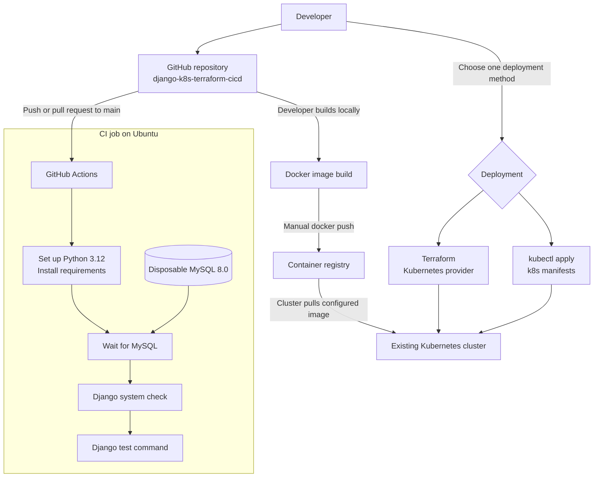
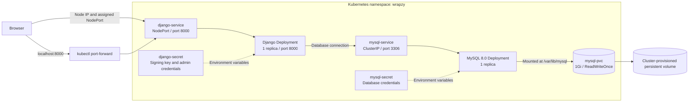
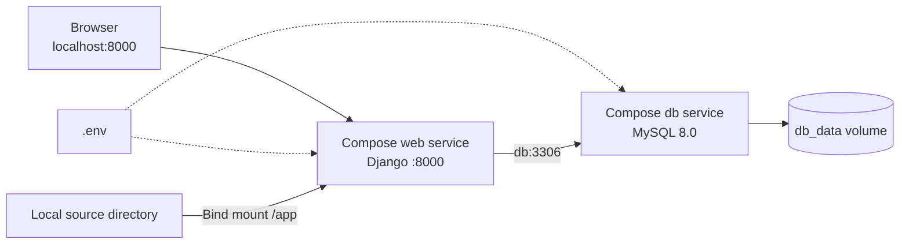

# Django Kubernetes Terraform CI/CD

[](https://github.com/prapanjanprabhu/django-k8s-terraform-cicd/actions/workflows/ci.yml)

**django-k8s-terraform-cicd** demonstrates running a Django application with MySQL, packaging it with Docker, deploying it to Kubernetes, managing infrastructure with Terraform, and validating changes through GitHub Actions.

The included application is **Wrapzy**, a gift-shopping website. Its container images and Kubernetes namespace use the name `wrapzy`.

## Contents

- [Current capabilities](#current-capabilities)
- [Architecture](#architecture)
- [Technology stack](#technology-stack)
- [Project structure](#project-structure)
- [Get the source](#get-the-source)
- [Local setup with Docker Compose](#local-setup-with-docker-compose)
- [Checks and tests](#checks-and-tests)
- [Kubernetes deployment](#kubernetes-deployment)
- [Terraform deployment alternative](#terraform-deployment-alternative)
- [Troubleshooting](#troubleshooting)
- [Deployment limitations](#deployment-limitations)

## Current capabilities

- Customer registration and login, product browsing, carts, and gift orders.
- Custom administration pages for products, storefront content, and order status.
- Docker Compose for local Django and MySQL services.
- Kubernetes Deployments, Services, Secrets, and persistent MySQL storage.
- Terraform configuration for Kubernetes resources.
- GitHub Actions checks and tests on pushes and pull requests to `main`.

The current workflow implements CI only: it does not build or publish images, deploy changes, automatically repair code, or roll back releases. Kubernetes Deployments provide basic pod replacement, but the supplied manifests do not define application health probes.

## Architecture

### Source, CI, and deployment



CI runs independently of deployment. Building images, publishing them, and applying infrastructure are manual steps in this repository. Terraform uses the `minikube` kubeconfig context by default.

### Kubernetes runtime



The Django container runs `migrate` before `runserver`. Database connection values are configured separately on the Django Deployment. The raw manifests assign a NodePort automatically; Terraform defaults to `32565`. MySQL is reached through its internal Service.

### Local development



Compose waits for its MySQL health check before starting the web service. The local source bind mount supports development, and the named volume preserves database data.

## Technology stack

| Component | Repository configuration |
| --- | --- |
| Application | Python 3.12 image, Django, server-rendered templates |
| Database | MySQL 8.0 with mysqlclient |
| Containers | Docker and Docker Compose |
| Orchestration | Kubernetes Deployments, Services, Secrets, and PVC |
| Infrastructure | Terraform >= 1.6.0; HashiCorp Kubernetes provider ~> 2.0 |
| Continuous integration | GitHub Actions on pushes and pull requests to main |

Exact Python package pins are in [requirements.txt](requirements.txt).

## Project structure

```text
.github/workflows/ci.yml   GitHub Actions checks and tests
P1/                       Django settings and root URL configuration
gift/                     Application views, models, forms, and templates
k8s/                      Kubernetes manifests
terraform/                Kubernetes infrastructure configuration
.env.example              Local environment template
Dockerfile                Python 3.12 application image
docker-compose.yml        Local web and MySQL services
requirements.txt          Pinned Python dependencies
manage.py                 Django management commands
```

## Get the source

```bash
git clone https://github.com/prapanjanprabhu/django-k8s-terraform-cicd.git
cd django-k8s-terraform-cicd
```

## Local setup with Docker Compose

Install Docker with Docker Compose support, then run the following commands from the repository root.

### 1. Configure the environment

Copy `.env.example` to `.env`:

```powershell
# PowerShell
Copy-Item .env.example .env
```

```bash
# Linux / macOS
cp .env.example .env
```

Edit `.env` with your own values. The application and Compose configuration use these variables:

| Variable | Purpose / local value |
| --- | --- |
| `DJANGO_SECRET_KEY` | A private Django signing key |
| `DJANGO_DEBUG` | `True` for local development; the comparison is case-sensitive |
| `DJANGO_ALLOWED_HOSTS` | `localhost,127.0.0.1` for local access |
| `DB_NAME` | MySQL database name, for example `one` |
| `DB_USER` | MySQL application user, for example `django` |
| `DB_PASSWORD` | Password for the application database user |
| `DB_HOST` | `db` when using Docker Compose |
| `DB_PORT` | `3306` |
| `MYSQL_ROOT_PASSWORD` | MySQL root password used by Compose |
| `ADMIN_USERNAME` | Username for the custom application administrator |
| `ADMIN_PASSWORD` | Password for the custom application administrator |

Use a non-root `DB_USER` for the Compose MySQL service. Keep credentials private. The Kubernetes configuration is separate from `.env`.

### 2. Build and initialize the database

```bash
docker compose up -d --build db
docker compose run --rm web python manage.py makemigrations gift
docker compose run --rm web python manage.py migrate
docker compose up -d web
```

The repository currently contains only `gift/migrations/__init__.py`, so the initial application migration must be generated. Compose mounts the repository into `/app`, so generated migration files are written into your checkout. The current `.gitignore` excludes migration files. To version them, remove the `**/migrations/*.py` ignore rule or explicitly stage the generated migration with `git add -f gift/migrations/0001_initial.py` (use its actual filename). Review and commit migrations before building an image for deployment. Rebuild the image after adding migrations.

Open <http://localhost:8000/>. The custom administrator login is at <http://localhost:8000/admin-login/> and uses `ADMIN_USERNAME` and `ADMIN_PASSWORD`. The standard Django `/admin/` route is not configured.

### 3. Inspect or stop the services

```bash
docker compose ps
docker compose logs --tail=100 web db
docker compose down
```

MySQL data is stored in the `db_data` named volume and survives an ordinary `docker compose down`.

## Checks and tests

With the database running and `.env` configured:

```bash
docker compose run --rm web python manage.py check
docker compose run --rm web python manage.py test
```

Django tests that use a database need permission to create a test database. If the application user lacks that permission, use a dedicated test database account. The CI workflow uses root credentials only for its disposable MySQL service.

The workflow in [`.github/workflows/ci.yml`](.github/workflows/ci.yml) sets up Python 3.12, installs `requirements.txt`, waits for MySQL 8.0, then runs `manage.py check` and `manage.py test`. `gift/tests.py` currently contains only the generated placeholder, so this workflow does not yet provide application behavior coverage.

## Kubernetes deployment

Prerequisites: a running Kubernetes cluster, `kubectl` configured for that cluster, persistent-volume provisioning, and a container image reachable from the cluster.

1. Generate and commit the application migrations using the local setup steps.
2. Build and push your application image to a registry you control:

   ```bash
   docker build -t YOUR_REGISTRY/wrapzy:YOUR_TAG .
   docker push YOUR_REGISTRY/wrapzy:YOUR_TAG
   ```

3. Set that image in `k8s/django-deployment.yaml`. Compose currently names its image `prapanjanprabhu/wrapzy:v1`, while Kubernetes defaults to `prapanjanprabhu/wrapzy:v4`; a local Compose build does not update the cluster image automatically.
4. Replace the supplied values in `k8s/django-secret.yaml` and `k8s/mysql-secret.yaml`. Match the database name, user, and password in `k8s/django-deployment.yaml` to the MySQL values. The Django database password is currently a literal environment value in that manifest.
5. Set `DJANGO_ALLOWED_HOSTS` to the hosts you will use. Confirm the cluster can provision the requested `1Gi` MySQL volume.
6. Apply the resources, starting with the namespace and database:

```bash
kubectl apply -f k8s/namespace.yaml
kubectl apply -f k8s/mysql-secret.yaml
kubectl apply -f k8s/mysql-pvc.yaml
kubectl apply -f k8s/mysql-service.yaml
kubectl apply -f k8s/mysql-deployment.yaml
kubectl rollout status deployment/mysql -n wrapzy
kubectl logs deployment/mysql -n wrapzy --tail=50
```

Check the MySQL logs for readiness before starting Django; these manifests have no database readiness probe.

```bash
kubectl apply -f k8s/django-secret.yaml
kubectl apply -f k8s/django-service.yaml
kubectl apply -f k8s/django-deployment.yaml
kubectl rollout status deployment/django -n wrapzy
kubectl get pods,svc,pvc -n wrapzy
kubectl port-forward service/django-service 8000:8000 -n wrapzy
```

While port forwarding is running, open <http://localhost:8000/>. The Django container runs migrations before starting the development server. Migration files must already be included in the image.

## Terraform deployment alternative

The [`terraform/`](terraform/) directory manages Kubernetes resources on an existing cluster. It does not provision the cluster itself. Use either Terraform or the raw manifests for a given installation to avoid competing ownership of the same resources.

Requirements: Terraform 1.6 or newer, access to the target Kubernetes cluster, and a compatible storage class. The provider in `terraform/provider.tf` reads `~/.kube/config` and selects the `minikube` context. For Minikube, run `minikube start` first; otherwise update the provider context for your cluster. Inspect available storage classes with `kubectl get storageclass`.

Create a private `terraform/terraform.tfvars` file with your own values:

```hcl
django_secret_key     = "REPLACE_WITH_A_PRIVATE_SIGNING_KEY"
django_admin_username = "admin"
django_admin_password = "REPLACE_WITH_A_PRIVATE_PASSWORD"
mysql_database        = "one"
mysql_user            = "django"
mysql_password        = "REPLACE_WITH_A_PRIVATE_DB_PASSWORD"
mysql_root_password   = "REPLACE_WITH_A_PRIVATE_ROOT_PASSWORD"
django_image          = "YOUR_REGISTRY/wrapzy:YOUR_TAG"
django_node_port      = 32565
mysql_storage_class   = "standard"
mysql_storage_size    = "1Gi"
```

Set `mysql_storage_class` to a storage class available in your cluster. The image must contain the application migrations.

```bash
terraform -chdir=terraform init
terraform -chdir=terraform fmt -check
terraform -chdir=terraform validate
terraform -chdir=terraform plan
terraform -chdir=terraform apply
```

After applying, inspect the outputs with `terraform -chdir=terraform output`. For Minikube, use `minikube service django-service -n wrapzy --url` to obtain an access URL, or use the port-forward command in the Kubernetes section. Review the plan before approving the apply. Keep variable files and Terraform state private: marking a variable sensitive does not remove its value from state.

## Troubleshooting

| Symptom | What to check |
| --- | --- |
| Missing environment variable / `KeyError` | Ensure `.env` contains all required application variables, or the deployment injects them. |
| Database connection fails | Use `DB_HOST=db` in Compose and `DB_HOST=mysql-service` in Kubernetes; check credentials and database logs. |
| Missing application tables | Generate `gift` migrations, run `migrate`, and include migration files in deployed images. |
| `DisallowedHost` | Add the actual hostname or IP to `DJANGO_ALLOWED_HOSTS`. |
| Kubernetes pod fails to start | Inspect `kubectl logs deployment/django -n wrapzy` and `kubectl describe pods -n wrapzy`; check migration failures and image availability. |
| MySQL PVC stays pending | Check available storage classes and persistent volumes. |
| Existing MySQL volume rejects new credentials | Changing environment variables does not reconfigure accounts in an already initialized database. Update the database accounts to match. |

## Deployment limitations

The supplied Docker and Kubernetes configurations run Django's development server. Production deployment still needs a production server configuration, static and uploaded-media serving, application health probes, and appropriate host and secret configuration. Gunicorn is listed as a dependency but is not used by the current startup commands.

The checked-in Kubernetes Secret manifests contain credential values. Replace them before deployment and rotate any values that have been used in a real environment. MySQL has persistent storage, but the Django Kubernetes deployment does not mount persistent storage for uploaded media.
